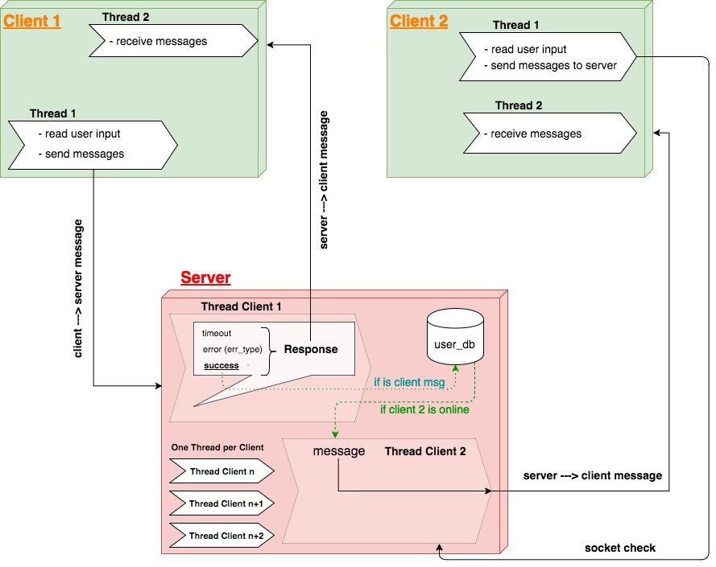

# CS262 Final Project

## System requirements

Install [Docker](https://docs.docker.com/install/)

## Running

(I) Start Kafka:

```
sh start_kafka.sh
```

(II) Spawn a Consumer for Testing Purposes

```
sh spawn_consumer.sh topic_name
```

(III) Spawn a Producer for Testing Purposes

```
sh spawn_producer.sh topic_name
```

(IV) Produce a Message for Testing Purposes

```
sh test_producer.sh
```

(V) Stop Everything Running in our Application

```
sh stop_everything.sh
```

(VI) Start Frontend Server

```
sh start_frontend.sh
```

(VII) Start Client

```
sh start_client.sh
```

OBS1: run the commands in different terminal windows/tabs

OBS2: no need to create topics in advance

OBS3: To check everything is running fine in your system, you can execute (I), (II), and (IV), in this order, in different terminal tabs/windows.


## Assignment specs

Build a client/server application with the following functions:

1. Create an account. You must supply a unique user name.

2. List accounts (or a subset of the accounts, by text wildcard)

3. Send a message to a recipient. If the recipient is logged in, deliver immediately; otherwise queue the message and deliver on demand. If the message is sent to someone who isn't a user, return an error message

4. Deliver undelivered messages to a particular user

5. Delete an account. You will need to specify the semantics of what happens if you attempt to delete an account that contains undelivered message.

## System requirements

To run this application successfully you will need to have __python 3__ installed in your machine. You can download it [here](https://www.python.org/downloads/).


## How to run

After cloning this repository, go to the main directory. There, you can run the chat application locally. The first step is to run the server by executing

```
python3 server/server.py 8080
```

And then, each time you want to start a new client, you can run

```
python3 client/client.py localhost 8080
```

We also started a test server running on a DigitalOcean server (Ubuntu 16.04.3 x64, 512 MB Memory, running in region SFO1). It can be accessed at 
```
python3 client/client.py 104.236.165.78 8080
```


## Architecture & Design



### Server's design

#### Behavior

For each request made by the client, one of the following must happen:

- __success__: the server successfully received a *valid* request from the client and it was able to perform the desired operation, followed by a response to the client

- __error__: the server successfully received an *invalid* request from the client, identified the error within the request, and responded to the client

- __timeout__: the server is busy or dead, which means it does nothing

#### Setup

Each time the server receives a *connect* request from a socket, it accepts the connection and immediately creates a new thread to handle the communication with that client. This means __the server creates a new thread for each active client communication__. It will kill the thread when the client asks to close the connection with the socket.

We know that for a large number of connections having a thread per client is not the best option, but since we were focusing on the main functionalities, we decided to do it this way. If we wanted the application to be highly scalable, we would probably use the [```select```](https://docs.python.org/2/library/select.html) module so we could have a fixed number of threads handling groups of clients.

The server also maintains a dictionary ```user_db``` of the following format

```
user_db = {
  'username_1': {'token': token, 'socket': socket, 'message_queue': [m1, m2, ..]},
  'username_2': {'token': token, 'socket': socket, 'message_queue': [m1, m2, ..]},
  ...
}
```

As shown above, for each username we keep

- a *token* that indicates whether or not the user is logged in

- a *socket* that stores the socket information for that specific client so we can deliver messages to it

- a *message_queue* list containing all undelivered messages


The data in this dictionary structure is __not__ persistent.

### Client's design

Prior to being logged in, every client contains a single thread that is responsible for managing all tasks. Upon successful login, the client creates a second thread. The first thread is responsible for reading the inputs and sending the messages, while the second thread is responsible only for receiving the messages.

The possible requests a client can make to the server are covered in the __Possible interactions: client ---> server__ section.


## Messages protocol

The messages being exchanged through the wire obey the following format:

```
version + payload_size + server_opcode + payload
```

where

- *version* indicates the protocol's version being used. It consists of a ```char```, implying it requires 1 byte

- *payload_size* indicates the size of the payload being sent. It consists of an ```int```, implying it requires 4 bytes

- *server_opcode* indicates the operation the client wants the server to perform (e.g., create_account, login, etc.). It consists of a ```char```, implying it requires 1 byte

- *payload* is the message being sent from client to server. It is a ```string``` with *payload_size* number of bytes following a specific format (see below)

Notice that this means that the *header* of each message consists of 6 bytes (*version + payload_size + server_opcode*).

### Payload format for Messages

When the user sends a message to another user the payload takes the following form

```
payload = username_length + username + message_body
```

where

- *username_length* indicates the size of the username being sent. It consists of an ```int```, implying it requires 1 byte

- *username* is a ```string``` with *username_length* number of bytes

- *message_body* is a ```string``` containing the message that the sender wants to deliver to the recipient


## Possible interactions: client ---> server

```
socket.connect()
```

- Server's action on success:

  - server creates a thread locally to handle sending and receiving messages with the client that just connected; returns success


- Server's action on error:

  - handled by the socket library


- Server's action on timeout (server is busy or dead):

  - handled by the socket library


```
socket.close()
```

- Server's action on success:

  - kills the thread that was created to handle the communication with that client

  - sets ```username[socket] = None``` and ```username[token] = None```


- Server's action on error:

  - handled by the socket library


- Server's action on timeout (server is busy or dead):

  - handled by the socket library


```
create_user
```

- Server's action on success:

  - valid username: user is created locally together with a unique token, a message queue, and its socket information; returns success


- Server's action on error:

  - invalid username: user already exists. Returns error with error message


- Server's timeout (server is busy or dead):

  - server does nothing

  - client does not retry
    - communicates user of timeout and asks for next instruction


```
login
```

- Server's action on success:

  - returns user token to client


- Server's action on error:

  - invalid username: user already exists
    - returns error with appropriate error message

  - user is already logged in
    - returns error with appropriate error message.


- Server's timeout (server is busy or dead):

  - server does nothing

  - client does not retry
    - communicates user of timeout and asks for next instruction


```
logout
```

- Server's action on success:

  - kills thread that was responsible for handling that client
  - sets ```username[token] = None``` to indicate no one is logged in for that user


- Server's action on error:

  - invalid username: user already exists
    - returns error with appropriate error message.


- Server's timeout (server is busy or dead):

  - server does nothing

  - client does not retry
    - communicates user of timeout and asks for next instruction


```
delete
```

- Server's action on success:

  - deletes ```user_db[username]``` to indicate user no longer exists


- Server's action on error:

  - invalid username: user does not exist
    - returns error with appropriate error message.


- Server's timeout (server is busy or dead):

  - server does nothing

  - client does not retry
    - communicates user of timeout and asks for next instruction


```
retrieve 
```

- Server's action on success:

  - returns user message containing all queued messages
  - clears the queue in the server data base for current user


- Server's action on error:

  - handled by the socket library


- Server's timeout (server is busy or dead):

  - handled by the socket library


```
list 
```

- Server's action on success:

  - returns user message containing user names for all users in messaging app


- Server's action on error:

  - handled by the socket library


- Server's timeout (server is busy or dead):

  - handled by the socket library


```
send
```

- Server's action on success:

  - when target user is logged in:
    - returns user message confirming delivery
  
  - when target user is not logged in:
    - queue message in target user queue


- Server's action on error:

  - returns error with appropriate error code
  

- Server's timeout (server is busy or dead):

  - handled by the socket library


## What we did not worry about (at this point!)

### Safety

Currently our whole system is completely open to the world in basically all senses. We use no encryption for the messages being exchanged between client and server, as well as no signatures. Authentication is ignored at this point. All these weaknesses can be easily exploited by men-in-the-middle attacks as well as any other kind of attacks. Another possible vulnerability to be exploited is to try to overflow the queued messages for a specific client.

### Persistency

The information on the server is not persistent at this time. This means that as soon as the server dies, all the information about users, queued messages, tokens, and everything else is lost.
